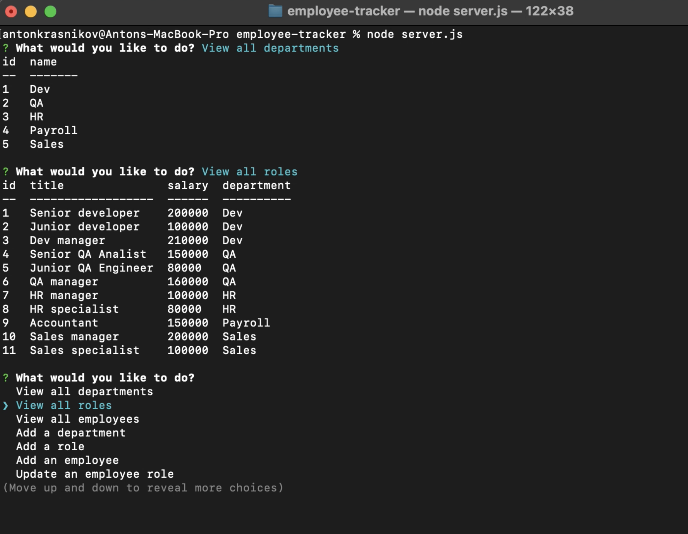

# Employees tracker (SQL Challenge). 
  
## Description
  
Employee tracker is a command-line application from scratch to manage a company's employee database, using Node.js, Inquirer, and MySQL.

## Table of Contents
- [Installation](#installation)
- [Usage](#usage)
- [Contributing](#contributing)
- [Test instructions](#test-instructions)
- [License](#tlicense)
- [Questions](#questions)

## Installation

For the application to work correctly, you need to download and install Node.js and npm.  Detailed instructions can be found by clicking on the link <https://nodejs.org/en/>.  You also need to install inquirer 8.2.4 (the instruction is available at the link <https://www.npmjs.com/package/inquirer>. You’ll need to use the MySQL2 package to connect to your MySQL database and perform queries, the Inquirer package to interact with the user via the command line, and the console.table package to print MySQL rows to the console.
  
## Usage
  
in order to use the application, you need to open a terminal window and switch to the current directory with the server.js file.  Then run the application by entering the node server.js command.  After that, you need to enter the information requested by the application. 
### Screen record
https://pdx.nv.instructuremedia.com/fetch/QkFoYkIxc0hhUVR1ZDV3RE1Hd3JCOVF1cG1NPS0tNzE5NTYyMWZlMGViZGIzODFlMmViOWVjNjA1ODY4YmE5YjAxNTllZA.mp4

### Web page screenshot

  
## Contributing

Pull requests are welcome. For major changes, please open an issue first to discuss what you would like to change. Please make sure to update tests as appropriate.

## Test instructions

in order to test the application use the command "npm run test" from folder "__tests__". The folder contains unit tests for Employee, Engineer, Imntern and Manager classes.

## License

### The MIT license
  (https://opensource.org/licenses/MIT)

## Questions

If you have any questions please contact me any time!

My GitHhub: <https://github.com/kas500>

My email: <krasnikovanton84@gmail.com>
